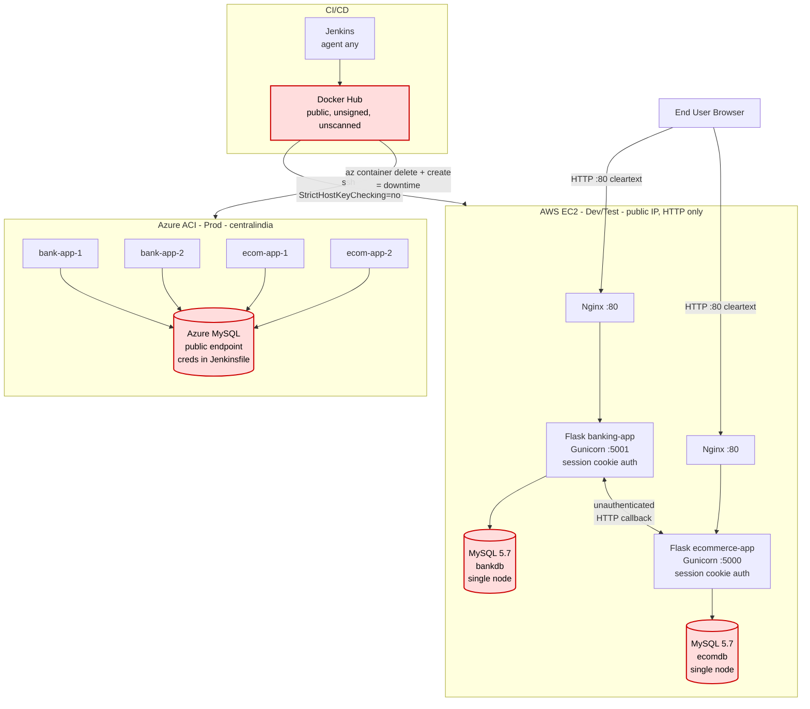

# Current State ("As-Is")

Reconstructed directly from the repository, not from the README's aspirational description.

## Diagram

## Component inventory

| Component | Implementation | Source |
|---|---|---|
| Banking web + API | Flask 3.0.3 monolith, Gunicorn, session cookies | `banking-app/app.py` |
| Ecommerce web + API | Flask 3.0.3 monolith, Gunicorn, session cookies | `ecommerce-app/app.py` |
| Persistence | MySQL 5.7 per app, SQLite silent fallback | `docker-compose.*.yml`, `app.py` |
| Data model | SQLAlchemy, `Float` money columns | `*/models.py` |
| Reverse proxy | Nginx, HTTP :80, no TLS | `*/nginx/nginx.conf` |
| Orchestration (dev) | Docker Compose on a single EC2 VM | `docker-compose.*.yml` |
| Orchestration (prod) | Azure Container Instances, 2 per app | `Jenkinsfile` |
| K8s manifests | Present but unused; `type: LoadBalancer`, plaintext `Secret` | `*/k8s/` |
| CI/CD | Jenkins → Docker Hub → SSH/`az` CLI | `*/Jenkinsfile` |
| Registry | Docker Hub, `:latest` mutable tag | `Jenkinsfile` |

## Runtime coupling

The two services are **bidirectionally, synchronously coupled** over plain HTTP:

- `ecommerce-app` embeds `BANK_PUBLIC_BASE` into the QR payload it renders.
- `banking-app` calls `ECOM_CALLBACK_BASE` three times during a single payment:
  `GET /api/orders/{id}` on render, `GET /api/orders/{id}` again on submit, then
  `POST /api/orders/{id}/paid` before it moves any money.

There is no retry queue, no circuit breaker, no compensating transaction, and no
idempotency barrier. A timeout on the third call leaves the system in an
indeterminate state.

## What the prototype does well

Worth preserving through the migration:

- `/health` endpoints already exist on both services with K8s probes wired to them.
- `seed.py` is genuinely idempotent — re-running it is safe.
- Configuration is already environment-variable driven, so a move to
  Key Vault / CSI Secrets Store is a small change.
- Order expiry (`expires_at`, 300s) and a duplicate-order check already exist —
  the concepts are right, the enforcement is not yet safe.
- Stock is decremented inside the same commit that marks an order `PAID`.
