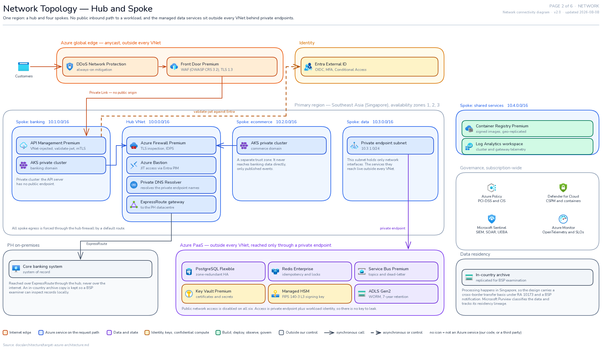
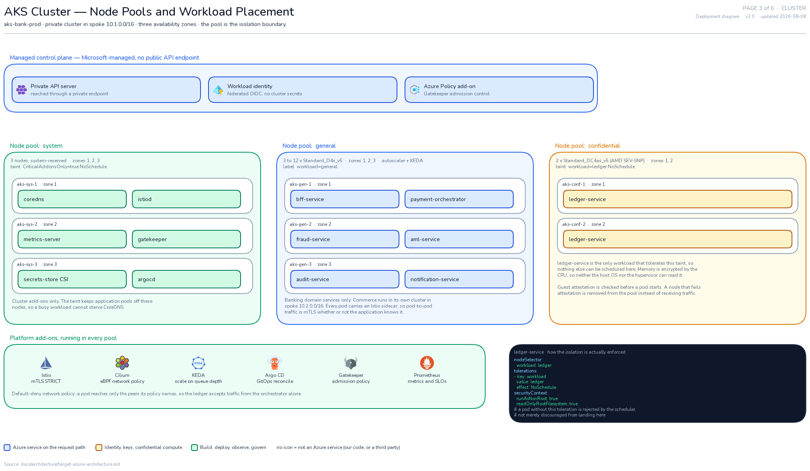
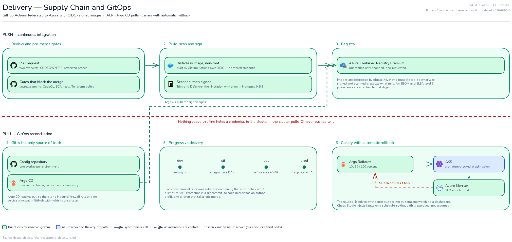
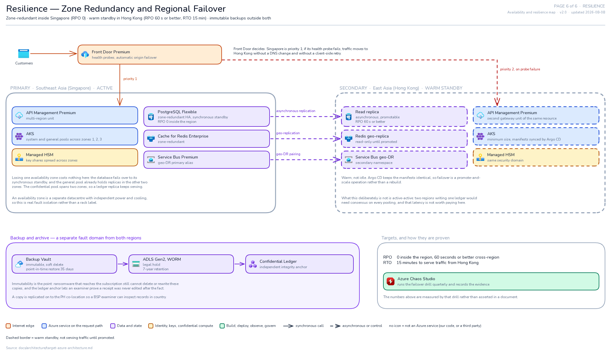

# Azure Target Architecture — Excalidraw Diagrams

Six pages describing the Azure-native target for the QR payment platform. Each page is a
standalone `.excalidraw` file: open it at [excalidraw.com](https://excalidraw.com) (File →
Open) or in the Obsidian Excalidraw plugin. Icons are embedded in the file, so nothing
needs to be fetched to view or edit them.

These are the visual companion to [`../target-azure-architecture.md`](../target-azure-architecture.md).
The Mermaid sources in [`../diagrams/`](../diagrams/) remain the machine-readable version;
these pages are the ones intended for a design review or a whiteboard walkthrough.

**Scope: these describe the target design only.** They do not document the current
implementation, and they are not a migration plan. For what is wrong with the code today
see [`../critical-findings.md`](../critical-findings.md); for sequencing see
[`../migration-roadmap.md`](../migration-roadmap.md).

## Pages

They are ordered by zoom level, so each one answers a question the previous one raised.

| # | File | The question it answers |
|---|------|-------------------------|
| 1 | [`01-context.excalidraw`](01-context.excalidraw) | What is in scope, who uses it, and what does it depend on? One black box, no internals. |
| 2 | [`02-network.excalidraw`](02-network.excalidraw) | How is the network shaped, and where can traffic actually enter? |
| 3 | [`03-cluster.excalidraw`](03-cluster.excalidraw) | What runs where inside the cluster, and what keeps the ledger isolated? |
| 4 | [`04-payment-flow.excalidraw`](04-payment-flow.excalidraw) | What happens, in order, when someone pays? |
| 5 | [`05-delivery.excalidraw`](05-delivery.excalidraw) | How does code get from a pull request into production? |
| 6 | [`06-resilience.excalidraw`](06-resilience.excalidraw) | What survives a zone failure, and what happens if a region goes? |

PNG previews are in [`preview/`](preview/).

### Page 1 — System context


### Page 2 — Network topology


### Page 3 — Cluster and node pools


### Page 4 — Payment runtime


### Page 5 — Delivery


### Page 6 — Resilience


## Reading conventions

The same taxonomy applies on every page. The wording lives in one place
(`tools/exlib.py`, `LEGEND`) and the pages only name the keys, so a colour cannot come to
mean two things in two places. The categories are written to be *decidable* — for any
element exactly one of them fits:

| Colour | Meaning |
|--------|---------|
| Orange | Internet edge — the public entry point |
| Blue | An Azure service **on** the request path |
| Purple | Data and state |
| Amber | Identity, keys, confidential compute |
| Green | Build, deploy, observe, govern — **off** the request path |
| Grey | Outside our control: actors, third parties, on-premises |

- **Solid arrow** — synchronous call. **Dashed arrow** — asynchronous or control.
- **Dashed border** — warm standby, not serving traffic until promoted. Active versus
  standby is carried by border style rather than colour, so the colour keeps its meaning
  and the distinction survives being printed in greyscale.
- **A card with no icon** is not an Azure service: either a service this team writes, or a
  third party. Official product icons are never used to stand in for our own components.
- Colour is reinforcement only. Every element is also labelled, so nothing depends on
  distinguishing two hues.

## Two things worth knowing

**Managed data services are drawn outside the VNet.** PostgreSQL, Redis, Service Bus,
Key Vault, Managed HSM and ADLS are Azure PaaS: a private endpoint puts a network
interface in your subnet, but the service itself is not in the VNet. Page 2 shows the
private endpoint subnet inside the data spoke and the services outside it, because
[drawing a PaaS service inside a subnet is a specific inaccuracy the Well-Architected
guidance calls out](https://learn.microsoft.com/en-us/azure/well-architected/architect-role/design-diagrams).
The Mermaid source in `../diagrams/02-azure-network-topology.mmd` draws them inside the
spoke; where the two disagree, these pages are the more literal reading of how Private
Link works.

**Node pool sizing follows the cost model** in `../target-azure-architecture.md` §8
(3 × D4s v5 general, 2 × DC4as v5 confidential). The confidential pool spans two zones,
which is why page 6 claims a surviving replica rather than two.

## Regenerating

The pages are generated from Python so that layout is reviewable in a diff rather than
being an opaque blob.

```bash
cd tools

# 1. fetch icons — downloads the official Azure V24 set and the vendor marks.
#    Fails loudly if any icon cannot be resolved.
python3 _icons/collect.py

# 2. build the .excalidraw files (written to the parent directory)
for f in pages/0*.py; do python3 "$f"; done

# 3. geometry lint — must report zero issues
python3 lint.py
```

Builds are deterministic: regenerating without changing a page produces byte-identical
files, so a git diff only ever shows a real edit.

Rendering the PNG previews is optional and needs Node 20+ and
[`uv`](https://docs.astral.sh/uv/):

```bash
cd tools/render
./build-bundle.sh                       # bundles Excalidraw + its webfonts locally
uv sync && uv run playwright install chromium
uv run python render.py ../../0*.excalidraw --scale 1
uv run python view.py ../../02-network.png full   # downscaled copy for review
```

### What is checked automatically

Overlapping labels and arrows through boxes are invisible in JSON and obvious in a render,
so they are checked mechanically rather than by eye. `lint.py` reports:

- `TEXT_OVERLAP`, `TEXT_ON_CARD` — labels colliding, or a label landing on a box it does
  not belong to.
- `ARROW_THRU_TEXT`, `ARROW_THRU_CARD` — an arrow crossing something it does not connect.
- `CARD_OVERLAP`, `ESCAPES_ZONE` — boxes overlapping, or content spilling out of its
  container.

Text is measured, not estimated: `metrics.json` holds per-glyph advance widths sampled
from the real Excalidraw Nunito face (`render/charmetrics.py`), so `exlib` fails the build
if a string would overflow its box. It also rejects glyphs missing from the font subset —
`→` renders as a blank gap, so arrows inside labels are written `->`.

One limit worth knowing: the lint sees straight arrow segments, not Excalidraw's rendered
corner curves, which bulge outward from the declared path. Long routed arrows therefore
pass `sharp=True` for square elbows.

## Icon provenance

- **Azure services** — official [Azure architecture icons](https://learn.microsoft.com/en-us/azure/architecture/icons/)
  (V24). Microsoft permits their use in architecture diagrams and documentation; icons are
  not cropped, rotated, or recoloured.
- **CNCF projects** (Kubernetes, Istio, Argo, Helm, Prometheus, Gatekeeper/OPA, KEDA,
  Cilium) — [cncf/artwork](https://github.com/cncf/artwork).
- **Other marks** (GitHub, Terraform, Docker, Trivy, Notary) —
  [simple-icons](https://github.com/simple-icons/simple-icons), tinted to the documented
  brand colour.

`icons/collect.py` fails rather than substituting a placeholder if an icon cannot be
resolved. There is no official Azure icon for Microsoft Purview, so page 2 names it in
text instead of faking it with a similar mark.

## Caveats

Nothing here is provisioned. SKUs, sizing, subnet CIDRs and the RPO/RTO figures are design
intent to be validated by load testing and DR drills. Node names, taints and the cluster
name are proposed conventions, not deployed facts.
