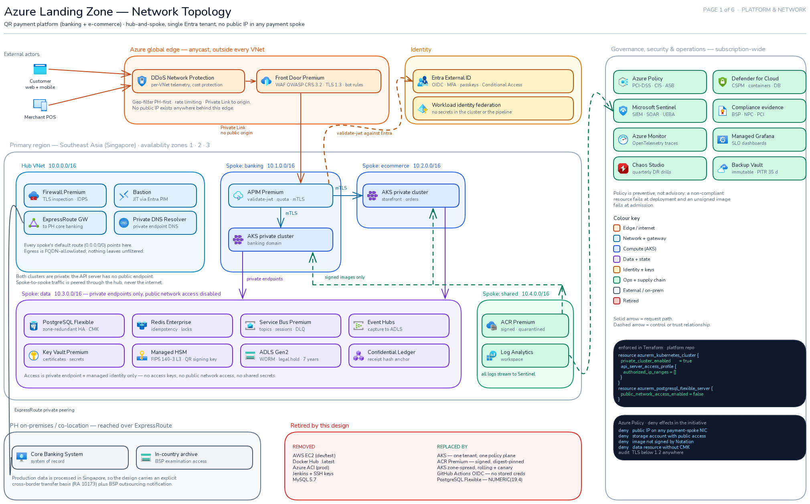
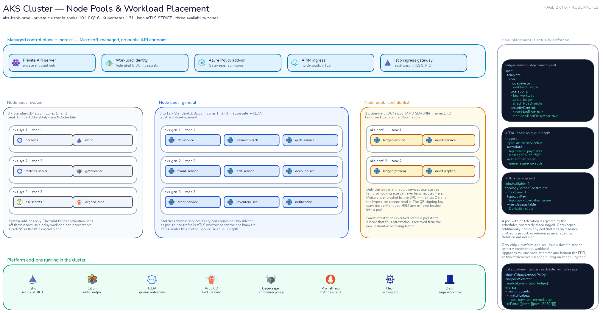
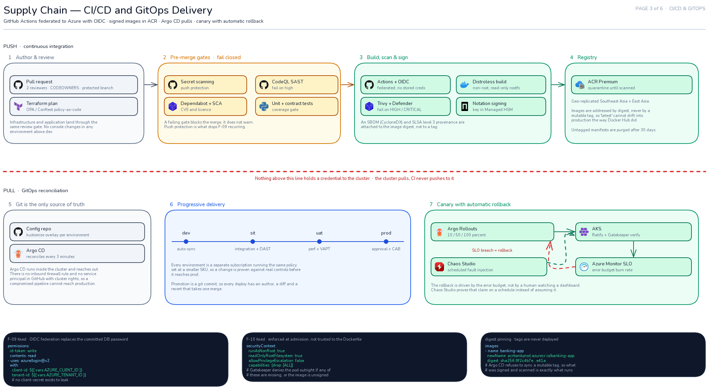
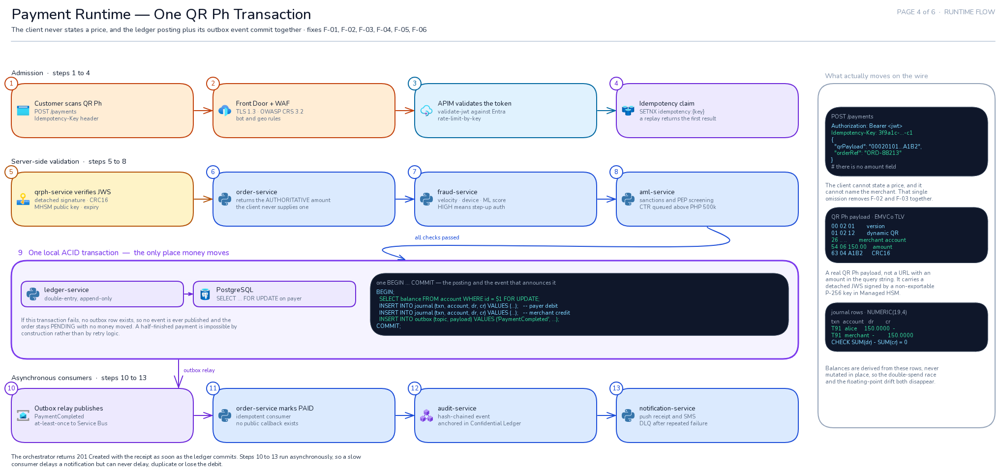
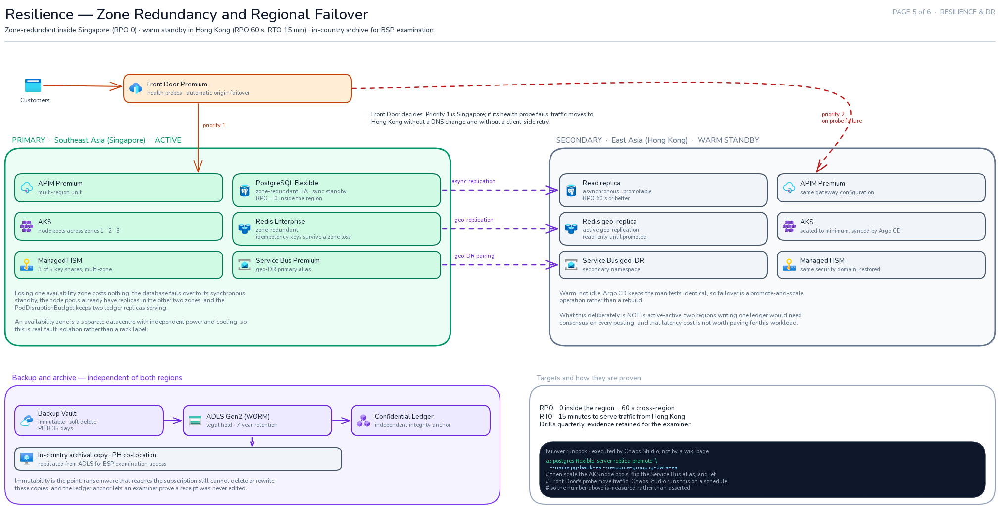
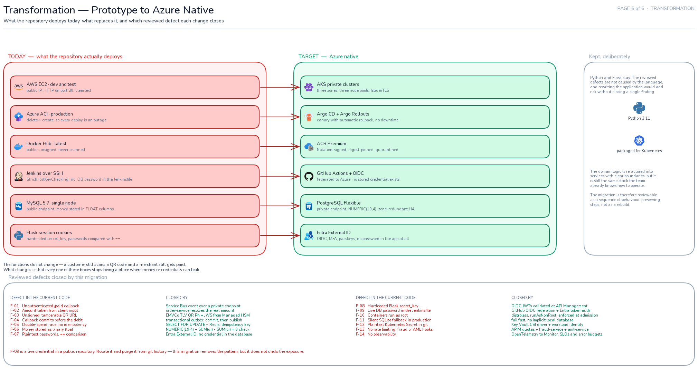

# Azure Target Architecture — Excalidraw Diagrams

Six pages describing the Azure-native target for the QR payment platform. Each page is a
standalone `.excalidraw` file: open it at [excalidraw.com](https://excalidraw.com) (File →
Open) or in the Obsidian Excalidraw plugin. Icons are embedded in the file, so nothing
needs to be fetched to view or edit them.

These are the visual companion to [`../target-azure-architecture.md`](../target-azure-architecture.md)
and [`../critical-findings.md`](../critical-findings.md). The Mermaid sources in
[`../diagrams/`](../diagrams/) remain the machine-readable version; these pages are the
ones intended for a design review or a whiteboard walkthrough.

## Pages

| # | File | What it argues |
|---|------|----------------|
| 1 | [`01-landing-zone.excalidraw`](01-landing-zone.excalidraw) | Hub-and-spoke topology. The network hierarchy *is* the security model — no payment spoke has a public address and all egress funnels through one firewall. |
| 2 | [`02-aks-nodes.excalidraw`](02-aks-nodes.excalidraw) | AKS node pools. The pool is the isolation boundary: the ledger runs on confidential compute behind a taint, so it cannot share a kernel with anything else. |
| 3 | [`03-cicd-gitops.excalidraw`](03-cicd-gitops.excalidraw) | Supply chain, split by a red line. Everything above it pushes and holds no cluster credential; everything below it pulls. |
| 4 | [`04-payment-flow.excalidraw`](04-payment-flow.excalidraw) | One QR payment, step by step. The amount is resolved server-side, and the ledger posting commits together with the event that announces it. |
| 5 | [`05-dr-resilience.excalidraw`](05-dr-resilience.excalidraw) | Zone redundancy and regional failover, drawn as a comparison so the warm-standby posture and the replication lag are readable at a glance. |
| 6 | [`06-transformation.excalidraw`](06-transformation.excalidraw) | Prototype versus target, one-to-one, with the reviewed defect each swap closes. |

PNG previews are in [`preview/`](preview/).

### Page 1 — Landing zone and network topology


### Page 2 — AKS node pools and workload placement


### Page 3 — CI/CD and GitOps delivery


### Page 4 — Payment runtime flow


### Page 5 — Resilience and DR


### Page 6 — Transformation


## Reading conventions

The same visual language is used on every page.

| Colour | Meaning |
|--------|---------|
| Orange | Edge / internet-facing |
| Light blue | Networking and gateways |
| Blue | Compute (AKS, domain services) |
| Purple | Data and state |
| Amber | Identity, keys, confidential compute |
| Green | Operations, governance, supply chain |
| Grey | External, on-premises, or standby |
| Red | Retired, or an anti-pattern being removed |

- **Solid arrow** — request path.
- **Dashed arrow** — control or trust relationship.
- **Dark panels** — evidence: real manifest fragments, SQL, and wire payloads rather than
  paraphrases, so a claim on the diagram can be checked against something concrete.

## Regenerating

The pages are generated from Python so that layout, text fitting, and icon embedding stay
consistent and reviewable in diffs.

```bash
cd tools

# 1. fetch icons — downloads the official Azure V24 set and the vendor marks.
#    Fails loudly if any icon cannot be resolved.
python3 _icons/collect.py

# 2. build the .excalidraw files (written to the parent directory)
for f in pages/0*.py; do python3 "$f"; done

# 3. geometry lint — must report zero issues
python3 lint.py
```

Builds are deterministic: regenerating without changing a page produces
byte-identical files, so a git diff only ever shows a real edit.

Rendering the PNG previews is optional and needs Node 20+ and
[`uv`](https://docs.astral.sh/uv/):

```bash
cd tools/render
./build-bundle.sh                       # bundles Excalidraw + its webfonts locally
uv sync && uv run playwright install chromium
uv run python render.py ../../0*.excalidraw --scale 1
uv run python view.py ../../01-landing-zone.png full   # downscaled copy for review
```

### Why there is a linter

Overlapping labels and arrows that cut through boxes are invisible in JSON and obvious in a
render, so they are checked mechanically instead of by eye:

- `TEXT_OVERLAP`, `TEXT_ON_CARD` — collisions between labels, or a label landing on a box
  it does not belong to.
- `ARROW_THRU_TEXT`, `ARROW_THRU_CARD` — an arrow crossing something it does not connect.
- `CARD_OVERLAP`, `ESCAPES_ZONE` — boxes overlapping, or content spilling out of its container.

Text is measured, not estimated: `metrics.json` holds per-glyph advance widths sampled from
the real Excalidraw Nunito face (`render/charmetrics.py`), so `exlib` fails the build if a
string would overflow its box. It also rejects glyphs missing from the font subset — `→`,
for example, renders as a blank gap, so arrows in labels are written as `->`.

## Icon provenance

- **Azure services** — official [Azure architecture icons](https://learn.microsoft.com/en-us/azure/architecture/icons/)
  (V24). Microsoft permits their use in architecture diagrams and documentation; icons are
  not cropped, rotated, or recoloured.
- **CNCF projects** (Kubernetes, Istio, Argo, Helm, Prometheus, OPA/Gatekeeper, KEDA,
  Cilium, Dapr, Notary) — [cncf/artwork](https://github.com/cncf/artwork).
- **Other marks** (GitHub, Terraform, Docker, Trivy, Python, MySQL, AWS, Jenkins) —
  [simple-icons](https://github.com/simple-icons/simple-icons) and
  [devicon](https://github.com/devicons/devicon), tinted to their documented brand colour.

Only the SVGs actually used are embedded, and `icons/collect.py` fails loudly rather than
substituting a placeholder if one cannot be resolved. There is no official Azure icon for
Microsoft Purview, so it is not shown rather than being faked with a similar mark.

## Scope

These diagrams describe a **target design**, not deployed infrastructure. Nothing here has
been provisioned. Sizing, SKUs, and the RPO/RTO figures are design intent to be validated
by load testing and DR drills.

One item is operational rather than architectural: **F-09 is a live database credential in a
public repository.** Rotate it and purge it from git history. This design removes the pattern
that caused it; it does not undo the exposure.
