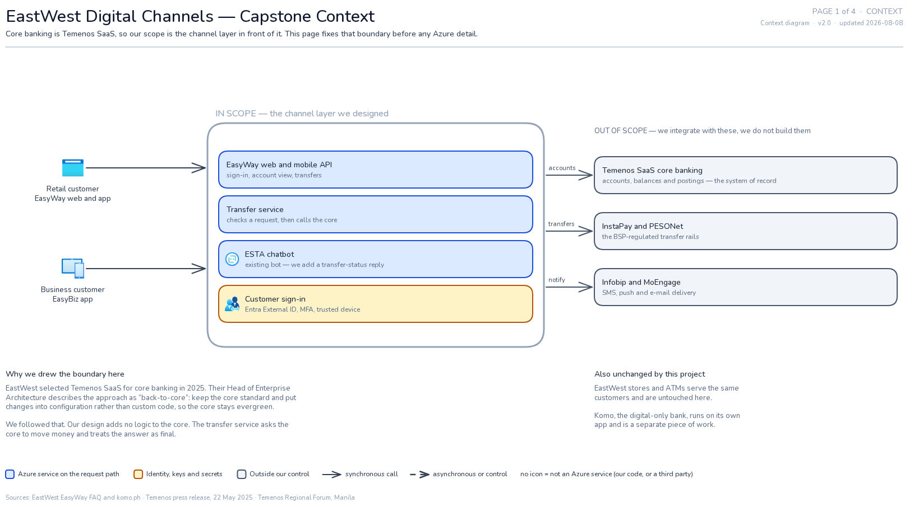
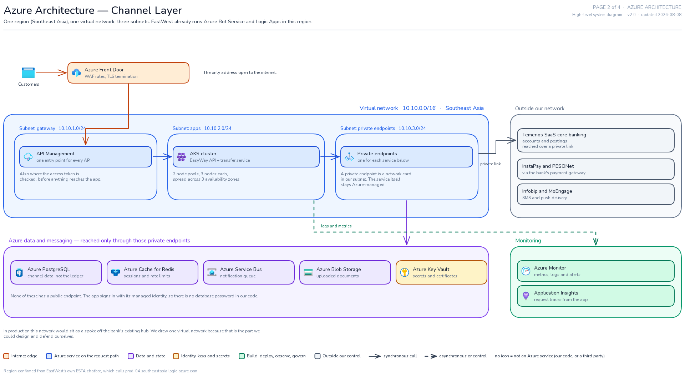
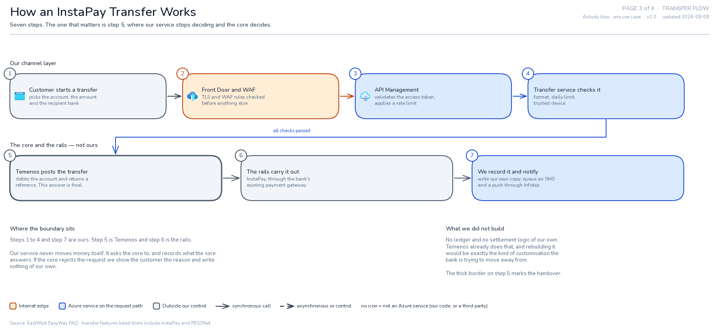
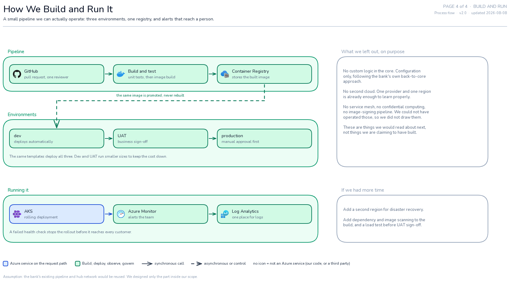

# Capstone Architecture — EastWest Digital Channel Layer

Four diagrams for the capstone re-presentation. Each is a standalone `.excalidraw` file:
open it at [excalidraw.com](https://excalidraw.com) (File → Open) or in the Obsidian
Excalidraw plugin. Icons are embedded, so the files open with nothing to fetch.

## The scope decision behind these diagrams

EastWest selected **Temenos SaaS** for core banking in May 2025, for Retail, SME and
Corporate. Their Head of Enterprise Architecture describes the approach as
**"back-to-core"**: keep the core standard, express changes as configuration rather than
custom code, and keep the core evergreen. He also said the bank got stuck previously
because it had built "thousands" of customisations.

So this design **does not touch the core.** The scope is the digital channel layer in front
of it — the part a project team would actually be given. The earlier version of this
architecture designed its own ledger, which both overstated our scope and pointed the
opposite way from the bank's real strategy.

## Pages

| # | File | Question it answers |
|---|------|---------------------|
| 1 | [`01-context.excalidraw`](01-context.excalidraw) | What did we design, and what did we deliberately leave alone? |
| 2 | [`02-azure-architecture.excalidraw`](02-azure-architecture.excalidraw) | What runs on Azure, in which network? |
| 3 | [`03-transfer-flow.excalidraw`](03-transfer-flow.excalidraw) | What happens, step by step, in an InstaPay transfer? |
| 4 | [`04-build-and-run.excalidraw`](04-build-and-run.excalidraw) | How do we ship it and know it is healthy? |

### Page 1 — Context


### Page 2 — Azure architecture


### Page 3 — Transfer flow


### Page 4 — Build and run


## What we found out about EastWest before drawing anything

This is the research the diagrams are built on, all from public sources.

**They already run Azure.** Loading EastWest's own ESTA chatbot page shows it calling
`directline.botframework.com` (Azure Bot Service, Direct Line channel),
`prod-04.**southeastasia**.logic.azure.com` (Azure Logic Apps), and Blob Storage. That is
why page 2 uses Southeast Asia and why ESTA appears as an existing Azure Bot Service
rather than something we invented.

**Their channels**, from their own FAQ and product pages:

| Channel | What it is |
|---------|-----------|
| **EasyWay** | Retail online + mobile banking. Web at `ewonline.eastwestbanker.com`. Registration by deposit account, debit card or credit card. Biometrics or passcode, with a registered device used to verify web logins and transactions. |
| **EasyBiz** | Business banking app. |
| **Komo** | Digital-only bank, app only, links EastWest Rural Bank accounts, in-app loans. |
| **ESTA** | "EastWest System Tech Assistant" chatbot on the consumer-lending site. |
| **ECHO** | Newer AI assistant for business banking. |
| **Stores and ATMs** | EastWest calls its branches *stores* — "store of account". |

**EasyWay's transfer features** are the ones page 3 models: bills payment, transfers to
other EastWest accounts, and **InstaPay** and **PESONet** to other banks.

**Third parties they use:** Temenos (core), Infobip and MoEngage (messaging and push).

## Reading conventions

The same colours mean the same thing on all four pages.

| Colour | Meaning |
|--------|---------|
| Orange | Internet edge — the only address open to the public |
| Blue | An Azure service **on** the request path |
| Purple | Data and state |
| Amber | Identity, keys and secrets |
| Green | Build, deploy, observe, govern — **off** the request path |
| Grey | Outside our control: customers, third parties, the core |

- **Solid arrow** — synchronous call. **Dashed arrow** — asynchronous or control.
- **A card with no icon** is not an Azure service: either something we would write, or a
  third party like Temenos.
- Page 3, step 5 has a **thick border**. That is the handover to the core.

## What we deliberately did not draw

Page 4 lists this, and it is worth stating here too. We left out service mesh,
confidential computing, image-signing pipelines, and multi-region active-active. Not
because they are wrong for a bank, but because we could not have operated or costed them,
and drawing them would have claimed more than we did.

We also drew **one virtual network** rather than a hub-and-spoke landing zone. In
production this network would be a spoke off the bank's existing hub. We designed the part
we could defend.

## Regenerating the diagrams

The diagrams are generated from Python so the layout is reviewable and consistent.

```bash
cd tools

# 1. fetch the icons (official Azure set + vendor marks). Fails if any is missing.
python3 _icons/collect.py

# 2. build the .excalidraw files into the parent directory
for f in pages/0*.py; do python3 "$f"; done

# 3. check the geometry -- must report zero issues
python3 lint.py
```

`lint.py` catches the things that are invisible in the file and obvious on a screen:
overlapping labels, arrows crossing boxes they do not connect to, and content spilling out
of its container. Text width is measured against the real font, so a label that would
overflow its box fails the build instead of shipping clipped.

Rendering the PNG previews is optional and needs Node 20+ and
[`uv`](https://docs.astral.sh/uv/):

```bash
cd tools/render
./build-bundle.sh
uv sync && uv run playwright install chromium
uv run python render.py ../../0*.excalidraw --scale 1
```

## Sources

- EastWest EasyWay app FAQ — <https://www.eastwestbanker.com/easyway-app>
- Komo — <https://www.komo.ph/about-us>
- ESTA chatbot — <https://chatbot.ewbconsumerlending.com/>
- Temenos press release, 22 May 2025 —
  <https://www.temenos.com/press_release/philippines-eastwest-to-accelerate-core-banking-modernization-with-temenos-saas/>
- "EastWest Bank's Journey to Cloud-Native Banking", Temenos Regional Forum, Manila —
  <https://www.temenos.com/blog/eastwest-banks-journey-to-cloud-native-banking/>
- Azure icons — <https://learn.microsoft.com/en-us/azure/architecture/icons/>

## Caveats

Nothing here is deployed. Address ranges, node counts and sizes are our proposals, not
EastWest's actual configuration — we only observed what is visible from the public
internet. Anything about their internal network, core integration or production topology is
our inference and should be treated as a student design, not as documentation of the bank.
