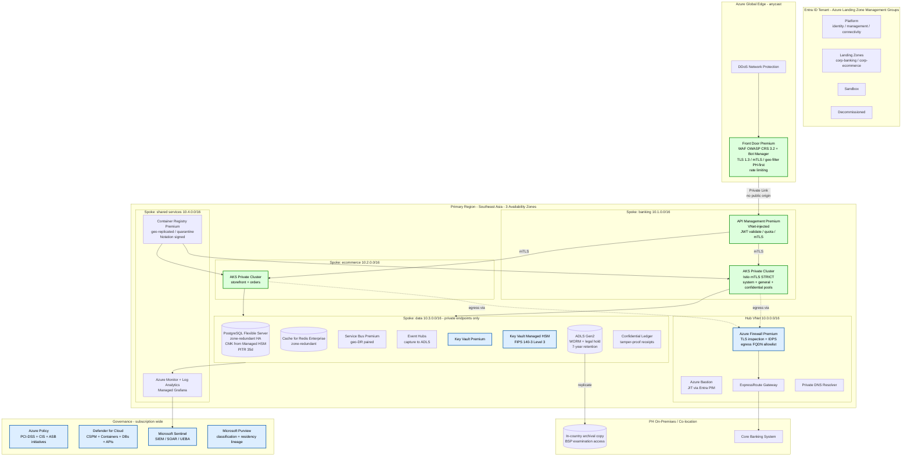
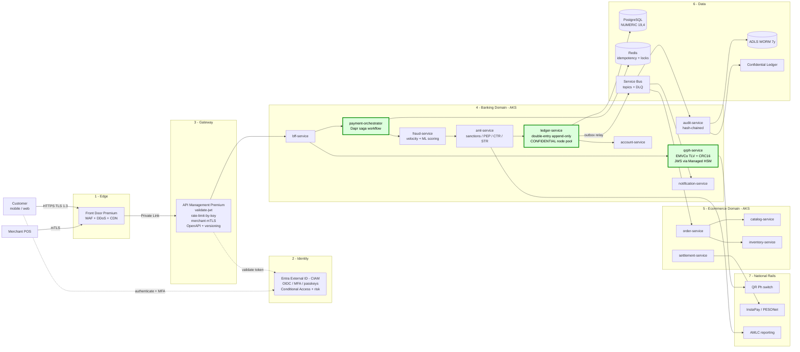
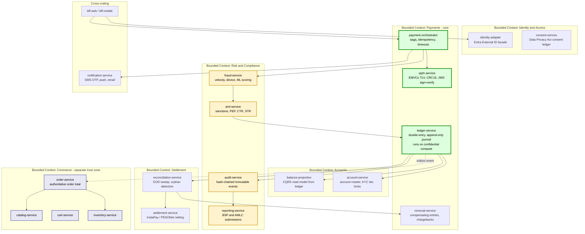
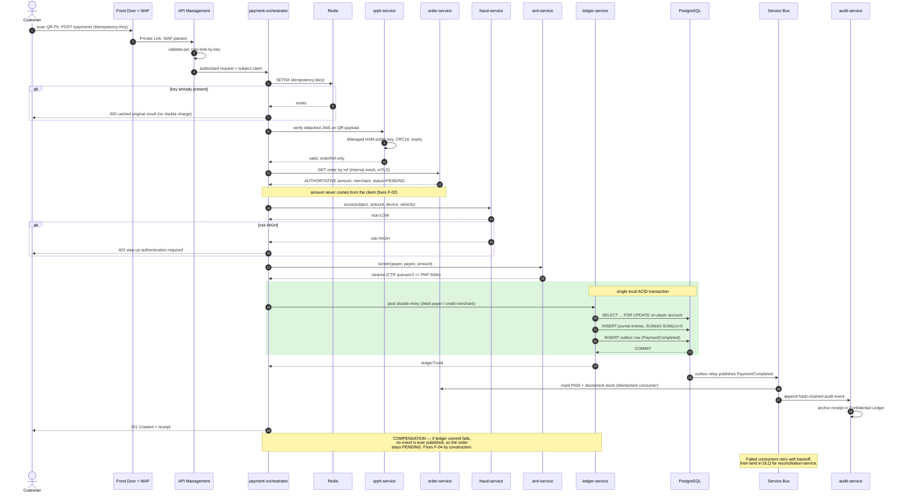
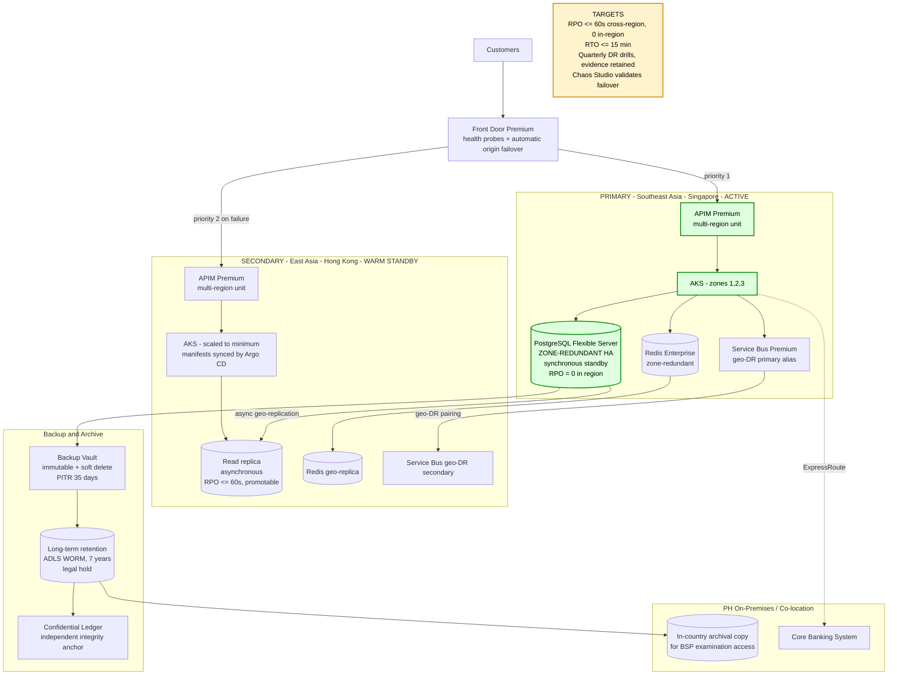

# Target State — Azure-Native Architecture

Single-cloud on Azure. AWS EC2 and Docker Hub are removed from the picture entirely;
Azure Container Instances is replaced by AKS.

---

## 1. Landing zone and network topology

Hub-and-spoke on the Azure Landing Zones (Enterprise Scale) pattern, with the payment
services in a spoke that has **no public IP anywhere in it**.



### Region selection — an explicit decision, not a default

**Azure has no Philippines region.** Microsoft's announced Southeast Asia footprint is
Singapore (`Southeast Asia`), Malaysia (`Malaysia West`, plus an announced second
Malaysian region), Indonesia, and Hong Kong (`East Asia`)
([Azure geographies](https://azure.microsoft.com/en-in/explore/global-infrastructure/geographies)).
My earlier draft placed this in "Southeast Asia (Manila proximity)" — that was wrong, and
the correction matters because it changes the compliance argument:

| | Choice | Rationale |
|---|---|---|
| Primary | **Southeast Asia** (Singapore) | Lowest latency to PH with 3 availability zones and full service coverage. ~30-40 ms RTT from Manila. |
| Secondary | **East Asia** (Hong Kong) | Separate geography, availability zones GA, Service Bus geo-DR pairing supported. |
| In-country | **PH co-location or Azure Local** | Holds the WORM archival copy of ledger and audit records so BSP examiners have in-country access, and so a total loss of both Azure regions does not destroy the statutory record. |

Because production data leaves the Philippines, the design must carry an explicit
cross-border transfer basis under the Data Privacy Act (RA 10173) and NPC rules, plus
the outsourcing notification/approval BSP expects for material cloud arrangements.
Microsoft publishes a
[Philippines FSI compliance checklist](https://download.microsoft.com/download/F/1/1/F11BF195-2233-479C-8AAD-868EBF328E33/Microsoft.FSI.Checklist.O365.Philippines.pdf)
for exactly this purpose. **Confirm the current circular numbers and notification
thresholds with the bank's compliance office before submission** — BSP has issued
material amendments through 2026 and this document should not be the authority on that.

### Why not keep the current prod platform

| Current | Problem | Azure target |
|---|---|---|
| AWS EC2 (dev) + Azure ACI (prod) | Two clouds, two threat models, no shared identity or policy plane. Dev and prod are not comparable, so testing proves little. | Single Azure tenant; dev/sit/uat/prod as subscriptions under one management group hierarchy with inherited policy. |
| Azure ACI | No VNet integration in the deployed config, no availability-zone spread, no HPA, no rolling update. The pipeline literally does `az container delete` then `create`. | AKS private cluster: zone-spread, HPA/KEDA, rolling and canary deploys, Gatekeeper admission control. |
| `centralindia` | Farther from PH users than Singapore and an odd fit for a PH residency narrative. | Southeast Asia primary. |
| Docker Hub | Public, mutable `:latest`, unsigned, unscanned. | ACR Premium: private endpoint, geo-replication, quarantine-until-scanned, Notation-signed, digest-pinned. |
| Jenkins + SSH + `StrictHostKeyChecking=no` | Long-lived SSH keys, host-key verification disabled, cloud credentials stored in the controller. | GitHub Actions with OIDC workload identity federation — no stored cloud credentials — plus Argo CD pull-based GitOps, so nothing needs inbound access to the cluster. |

---

## 2. Runtime request flow



### Azure service selection

| Layer | Service | Tier / config | Why this and not the alternative |
|---|---|---|---|
| DDoS | DDoS Network Protection | VNet-attached | Front Door includes L3/4 protection, but Network Protection adds per-VNet telemetry, cost protection, and the rapid-response support BSP incident handling expects. |
| Edge | Front Door Premium | WAF prevention mode, Private Link origin | Premium is required for Private Link to origin and for managed bot rules. App Gateway alone is regional and has no anycast edge. |
| CIAM | Entra External ID | OIDC, Conditional Access, passkeys | Removes credential storage from the bank's database entirely — F-07 and F-08 disappear rather than being mitigated. |
| Gateway | API Management **Premium** | VNet-injected, multi-region | Premium is the only tier with VNet injection + multi-region, both mandatory here. Standard v2 cannot meet the no-public-endpoint requirement. |
| Compute | AKS private cluster | Istio add-on, Workload Identity, Azure CNI Overlay, Cilium network policy | Container Apps was considered; rejected because it cannot express the confidential-compute node pool or the Gatekeeper admission policy the ledger needs. |
| Confidential compute | DCasv5 node pool (AMD SEV-SNP) | `ledger-service` only | Encrypts memory in use, so ledger state is not readable from the host. Combined with Azure Attestation this is a strong, checkable control for the most sensitive workload. |
| Database | PostgreSQL Flexible Server | Zone-redundant HA, CMK, PITR 35d, pgAudit, PgBouncer | **Switch from MySQL 5.7.** MySQL 5.7 is end-of-life. PostgreSQL gives exact `NUMERIC`, real `SELECT ... FOR UPDATE` semantics, transactional DDL, `pgAudit`, and logical replication for the outbox relay. This directly addresses F-05 and F-06. |
| Cache | Cache for Redis Enterprise | Zone-redundant, private endpoint | Idempotency keys, distributed locks, rate-limit counters, session revocation lists. |
| Messaging | Service Bus Premium | Topics, sessions, DLQ, geo-DR alias | Sessions give per-account FIFO ordering; DLQ gives a place for `reconciliation-service` to find failures. Replaces the synchronous HTTP callback that causes F-01 and F-04. |
| Keys | Key Vault **Managed HSM** | FIPS 140-3 Level 3 | Single-tenant HSM for CMK and the QR signing key. Non-exportable keys mean the QR signing key cannot be stolen even with cluster compromise (F-03). |
| Audit | ADLS Gen2 + Confidential Ledger | Immutable WORM, legal hold, 7y | WORM blocks deletion even by a subscription owner. Confidential Ledger anchors receipt hashes in an independent, blockchain-backed store, so tampering is detectable rather than merely discouraged (F-14). |
| Observability | Azure Monitor, App Insights, Managed Grafana | OpenTelemetry | Correlation ID propagated end-to-end — currently impossible. |
| SIEM | Microsoft Sentinel | UEBA, SOAR playbooks | BSP expects a functioning SOC capability, not just log retention. |
| Governance | Azure Policy, Defender for Cloud, Purview | PCI-DSS + CIS + ASB initiatives | Controls become preventive at admission time instead of advisory in a document. |

---

## 3. Service decomposition

The two monoliths become bounded contexts. **Commerce stays in a separate trust zone
from banking** — the current design has them calling each other's internals directly,
which is how F-01 became reachable.



### The ledger is the central design change

The current model mutates a balance column in place:

```python
consumer.balance -= amount
merchant.balance += amount
```

There is no record of *why* a balance is what it is, and a lost update is unrecoverable.
The target replaces this with an **append-only double-entry journal**:

- Every movement writes two or more entries summing to zero.
- Rows are `INSERT`-only. No `UPDATE`, no `DELETE` — enforced by table grants.
- Amounts are `NUMERIC(19,4)`, or `BIGINT` centavos.
- `balance-projection` maintains the queryable balance as a CQRS read model.
- `reconciliation-service` asserts `SUM(debits) - SUM(credits) = 0` per period and
  reports any drift as a P1 incident.

This gives replayability, a genuine audit trail, and a balance that is provable from
first principles — which is what an examiner actually asks for.

---

## 4. Payment saga

This sequence is where F-01, F-02, F-03, F-04 and F-05 are all structurally eliminated.



### QR Ph conformance

BSP Circular 1055 requires adoption of the National QR Code Standard, QR Ph, which is
built on the EMVCo QR specification
([BSP QR Ph FAQ](https://www.bsp.gov.ph/Media_and_Research/Primers%20Faqs/QR_Ph_P2M_FAQs.pdf),
[EMVCo QR Codes](https://www.emvco.com/emv-technologies/qr-codes/)).
The current implementation encodes an arbitrary HTTP URL, which is not QR Ph and is not
interoperable with any other PH wallet or bank.

Target: `qrph-service` emits EMVCo TLV with a CRC16 checksum, registered merchant
identifiers, and a detached JWS signature over the payload. The QR carries an **order
reference only** — no amount, no merchant account, no expiry the client can edit.

---

## 5. Supply chain and delivery

```mermaid
flowchart LR
    DEV["Developer"]
    PR["Pull Request<br/>branch protection<br/>2 reviewers + CODEOWNERS"]

    subgraph SEC["Pre-merge gates - GitHub Advanced Security"]
        SS["Secret scanning<br/>push protection"]
        CQ["CodeQL SAST"]
        DEP["Dependabot + SCA"]
        UT["Unit + contract tests<br/>coverage gate"]
        TF["Terraform validate<br/>OPA / Conftest policy-as-code"]
    end

    subgraph BUILD["Build - GitHub Actions, OIDC federated to Azure"]
        MS["Multi-stage distroless build<br/>non-root, read-only rootfs"]
        SBOM["SBOM - CycloneDX"]
        TRV["Trivy + Defender scan<br/>fail on HIGH/CRITICAL"]
        SIGN["Notation / Cosign signing<br/>key in Managed HSM"]
        ATT["Provenance attestation<br/>SLSA level 3"]
    end

    ACR["Azure Container Registry Premium<br/>quarantine until scanned<br/>geo-replicated SEA + EA"]

    subgraph ENV["Progressive delivery - Argo CD GitOps"]
        DEVE["dev<br/>auto-sync"]
        SIT["sit<br/>integration + DAST ZAP"]
        UAT["uat<br/>perf + VAPT + BSP change approval"]
        PRD["prod<br/>manual approval + CAB"]
    end

    ROLL["Argo Rollouts<br/>canary 10 - 50 - 100 percent<br/>auto-rollback on SLO breach"]
    AKS["AKS - Azure Policy admission<br/>signed images only<br/>Ratify + Gatekeeper"]

    OBS["Azure Monitor + App Insights<br/>SLO error budget"]
    CHAOS["Azure Chaos Studio<br/>scheduled fault injection"]

    DEV --> PR --> SEC
    SEC --> BUILD
    MS --> SBOM --> TRV --> SIGN --> ATT --> ACR
    ACR --> ENV
    DEVE --> SIT --> UAT --> PRD
    PRD --> ROLL --> AKS
    AKS --> OBS
    OBS -.->|"breach triggers rollback"| ROLL
    CHAOS --> AKS

    classDef gate fill:#ffe8cc,stroke:#cc7700,stroke-width:2px,color:#000
    classDef good fill:#ddffdd,stroke:#008800,stroke-width:2px,color:#000
    class SS,CQ,DEP,UT,TF,TRV gate
    class SIGN,ATT,ACR,ROLL good
```



Two properties matter most here:

1. **No stored cloud credentials.** GitHub Actions federates to Entra ID via OIDC. The
   secret that leaked in F-09 has no equivalent in the target design.
2. **Pull-based deployment.** Argo CD runs inside the cluster and pulls from git. Nothing
   external needs inbound network access or cluster credentials, unlike the current
   `ssh -o StrictHostKeyChecking=no` approach.

---

## 6. Disaster recovery



Warm standby rather than active-active is deliberate: an active-active ledger across
regions requires either distributed consensus on every posting or conflict resolution on
financial records. Both are worse than a 15-minute RTO for a domestic retail payment
service. Zone-redundant HA within Southeast Asia already covers the common failure modes
at RPO 0.

---

## 7. Non-functional targets

| Attribute | Current (measured from design) | Target | Mechanism |
|---|---|---|---|
| Availability | Single ACI instance per app, delete-and-recreate deploys → downtime every release | 99.99% | AKS across 3 AZs, zone-redundant DB, canary deploys |
| Latency P95 | Unbounded; 3 synchronous cross-service HTTP calls per payment | < 250 ms end-to-end | Async events, Redis cache, CQRS read model, regional proximity |
| Throughput | Untested | 2,000 TPS sustained, 5,000 peak | KEDA on queue depth, HPA, PgBouncer, read replicas |
| RPO | Undefined; volume snapshot only | 0 in-region, ≤ 60 s cross-region | Synchronous zone-redundant standby + async geo-replica |
| RTO | Undefined; manual rebuild | ≤ 15 min | Front Door failover, pre-synced Argo CD state, promotable replica |
| Ledger integrity | Float arithmetic, mutable rows | Provable | Double-entry, `NUMERIC`, append-only, hash-chained audit, Confidential Ledger anchor |
| Audit retention | None | 7 years, immutable | ADLS WORM + legal hold + in-country archival copy |
| Deploy frequency | Manual Jenkins trigger | On-demand, zero-downtime | GitOps + Argo Rollouts |
| MTTR | No telemetry — undetectable | < 30 min | OpenTelemetry, SLO alerting, Sentinel, runbooks |

---

## 8. What this costs

Rough monthly order of magnitude for the primary region, production only, USD. Intended
for go/no-go conversations, not budgeting.

| Item | Est. / month |
|---|---|
| AKS (3 × D4s v5 general + 2 × DC4as v5 confidential) | $1,200 |
| API Management Premium (1 unit, 2 regions) | $5,600 |
| Front Door Premium + WAF | $400 |
| PostgreSQL Flexible Server (zone-redundant HA + replica) | $1,100 |
| Redis Enterprise (zone-redundant) | $700 |
| Service Bus Premium (1 MU, geo-DR) | $1,400 |
| Key Vault Managed HSM | $3,200 |
| Defender for Cloud + Sentinel (ingest-dependent) | $1,500 |
| ACR Premium, ADLS, Monitor, Backup, Confidential Ledger | $900 |
| **Total** | **≈ $16,000** |

Managed HSM and APIM Premium together are roughly 55% of that. Both are load-bearing for
the compliance story — Managed HSM for FIPS 140-3 Level 3 key custody and non-exportable
QR signing keys, APIM Premium because it is the only tier offering VNet injection. If
budget forces a phase-1 compromise, Key Vault Premium (shared HSM, still FIPS 140-2
Level 3) is the defensible interim step; APIM Premium is not really negotiable given the
no-public-endpoint requirement.

Non-production environments should run dramatically cheaper tiers — the point of policy
inheritance is that the *controls* match while the *SKUs* do not.
